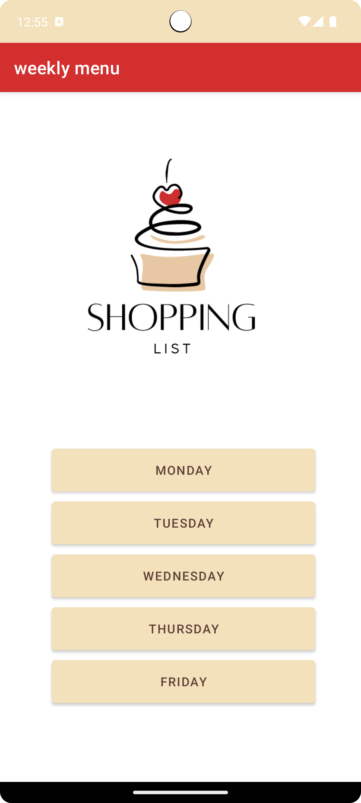
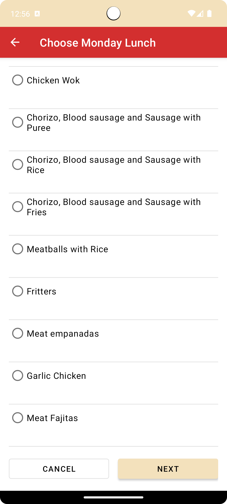
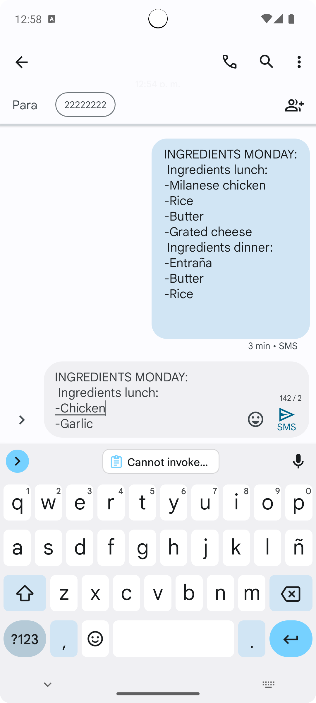

Shopping List App
===================================

Overview
--------------

Language
--------------
Kotlin

Screenshots
--------------
&ensp;

&ensp;

Purpose
--------------
This code demonstrates how to implement:

Other tools used:

Getting Started
---------------

1. Download and run the app.

## Developed By

Joaquina Tobler
